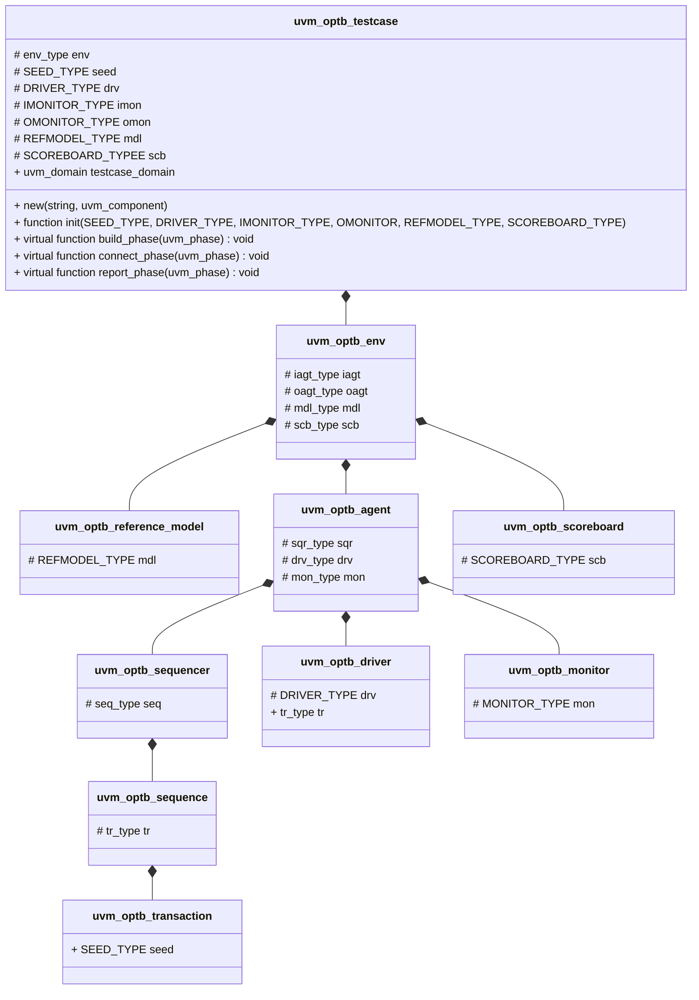
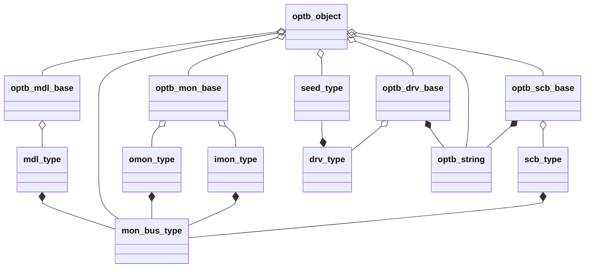
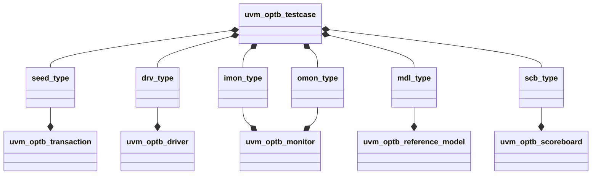

[TOC]

# **UVM_OPTB**

uvm_optb主要设计意图: **UVM Quick Start & Deployment**。

## 组成结构

uvm_optb组件由三类组成，uvm_optb_*组件，uvm_optb_\*wrapper\*工厂组件, optb_pkg基类。组件用途如下所述。

|name|用途|
|-|-|
|uvm_optb_*|uvm平台组成部分|
|uvm_optb_\*wrapper\*|uvm平台wrapper快速入口|
|optb_pkg|仅依赖于systemverilog语言特性的testbench基类|

uvm_optb_\*组件类关系类图如下：



optb_pkg基类及派生类功能说明如下

base|Derived|description
-|-|-
optb_object|optb_string|字符串wrapper pointer
optb_object|seed_type|给驱动波形发生器生成参数
optb_drv_base|drv_type|驱动波形发生器
optb_mon_base|mon_type|信号采样监测转换
optb_mdl_base|mdl_type|设计参考信号输入输出模型
optb_scb_base|scb_type|比对DUT波形与参考信号波形，输出验证结果

optb_pkg基类派生关系如下



uvm_optb_\*组件类与optb_pkg派生类关系类图如下：



## phase调用与类关系

phase name|显式调用的类名称
-|-
build_phase|uvm_optb_testcase</br>uvm_optb_env</br>uvm_optb_agent</br>uvm_optb_sequencer</br>uvm_optb_monitor</br>uvm_optb_reference_model</br>uvm_optb_scoreboard
connect_phase|uvm_optb_testcase</br>uvm_optb_agent</br>uvm_optb_sequencer</br>uvm_optb_driver</br>uvm_optb_monitor</br>uvm_optb_reference_model</br>uvm_optb_scoreboard
end_of_elaboration_phase|——
start_of_simulation_phase|uvm_optb_driver</br>uvm_optb_monitor</br>uvm_optb_reference_model</br>uvm_optb_scoreboard
run_phase|——
extract_phase|——
check_phase|——
report_phase|uvm_optb_testcase</br>uvm_optb_scoreboard
final_phase|——

与run_phase并行的phase。

phase name|显式调用的类名称
-|-
pre_reset_phase|——
reset_phase|——
post_reset_phase|——
pre_configure_phase|——
configure_phase|——
post_configure_phase|——
pre_main_phase|——
main_phase|uvm_optb_sequencer</br>uvm_optb_driver</br>uvm_optb_monitor</br>uvm_optb_reference_model</br>uvm_optb_scoreboard
post_main_phase|——
pre_shutdown_phase|——
shutdown_phase|——
post_shutdown_phase|——

## Demo

仅示意一种可能的使用方式，分为四部分叙述：

- 全局步长

```verilog
`define GLOBAL_TIMESCALE_STEP_PRECISION `timescale 1ns / 1ps
```

- 文件引用及`timescale`参数定义

```verilog
`include "uvm_macros.svh"
import uvm_pkg::*;

`include "uvm_optb_testcase.sv"
import uvm_optb_wrapper_pkg::*;
import optb_pkg::*;

`GLOBAL_TIMESCALE_STEP_PRECISION
```

- optb_pkg派生类的声明及定义

```verilog
class mon_bus_type extends optb_object;
    function new(); endfunction
endclass

class seed_type extends optb_object;
    randc bit[7:0] seed;
    constraint default_constraint{}
    function new(); super.new(); endfunction
    function void pre_randomize(); endfunction
    function void prost_randomize(); endfunction
endclass

class drv_type extends optb_drv_base #(.SEED_TYPE(seed_type));
    function new(optb_string info_src = null);
        super.new(); 
        this.info = info_src; 
    endfunction
    virtual task run(seed_type tseed = null,
                     output string tinfo = "");
        seed_type vseed;
        vseed = tseed;
        #1step;
        //use vseed
        //when tinfo changed in task run
        tinfo = "driver information..."
        this.info.str = (this.info.str == "0") ? "1" : "0";
    endtask
endclass

class mon_type extends optb_mon_base #(.MON_BUS_TYPE(mon_bus_type));
    function new(); super.new(); endfunction
    virtual task run(mon_bus_type tmon_bus = null);
        mon_bus_type vmon_bus;
        vmon_bus = tmon_bus;
        //use vmon_bus
        #1step;
    endtask
endclass

class mdl_type extends optb_mdl_base #(.IMON_BUS_TYPE(mon_bus_type),
                                       .OMON_BUS_TYPE(mon_bus_type));
    function new(); super.new(); endfunction
    virtual task run(mon_bus_type timon_bus = null,
                     mon_bus_type tomon_bus = null);
        mon_bus_type vimon_bus;
        mon_bus_type vomon_bus;
        vimon_bus = timon_bus;
        vomon_bus = tomon_bus;
        //use vimon_bus & vomon_bus
        #1step;
    endtask
endclass

class scb_type extends optb_mdl_base #(.MON_BUS_TYPE(mon_bus_type));
    function new(optb_string info_src = null);
        super.new();
        this.info = info_src;
    endfunction
    virtual task run(mon_bus_type tref_mon_bus = null,
                     mon_bus_type tmon_bus = null,
                     input string tinfo = "",
                     output string result = "is_ok");
        mon_bus_type vref_mon_bus;
        mon_bus_type vmon_bus;
        vref_mon_bus = tref_mon_bus;
        vmon_bus = tmon_bus;
        forever
        //use vref_mon_bus & vmon_bus
        //when this.info.str changed in task run
        #10step break;
        result = "is_ok";
    endtask
endclass
```

- 使用及运行代码段

```verilog
seed_type seed;
drv_type drv;
mon_type imon;
mon_type omon;
mdl_type mdl;
scb_type scb;

uvm_optb_testcase #(.TEST_CASE_TYPE("master"),
                    .DRV_INFO_PATH(""),
                    .DOMAIN_NAME("common"),
                    .SEED_TYPE(seed_type),
                    .IMON_BUS_TYPE(mon_bus_type),
                    .OMON_BUS_TYPE(mon_bus_type)) testcase;

initial
begin
    seed = new();
    drv = new();
    imon = new();
    omon = new();
    mdl = new();
    scb = new();
    testcase = new();

    testcase.init(seed, drv, imon, omon, mdl, scb);

    run_test();
end
```

## License

catagory|license
-|-
uvm_optb_\*|LGPLv3
uvm_optb_\*wrapper\*|Apache-2.0
optb_pkg|BSD-3-Clause
